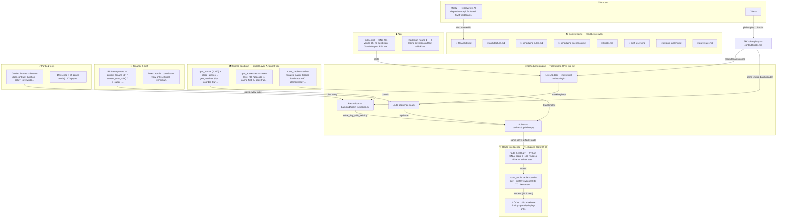

# 🧠 Maslul Brain — Mermaid mirror (GENERATED)

> **Do not edit.** Source: [maslul-brain.canvas](maslul-brain.canvas) (open the repo as an Obsidian vault for the rich view). Regenerate with `python tools/brain_mermaid.py` — same commit as any canvas change.
> Renders natively on GitHub; in VS Code install the *Markdown Preview Mermaid Support* extension and hit Ctrl+Shift+V.

